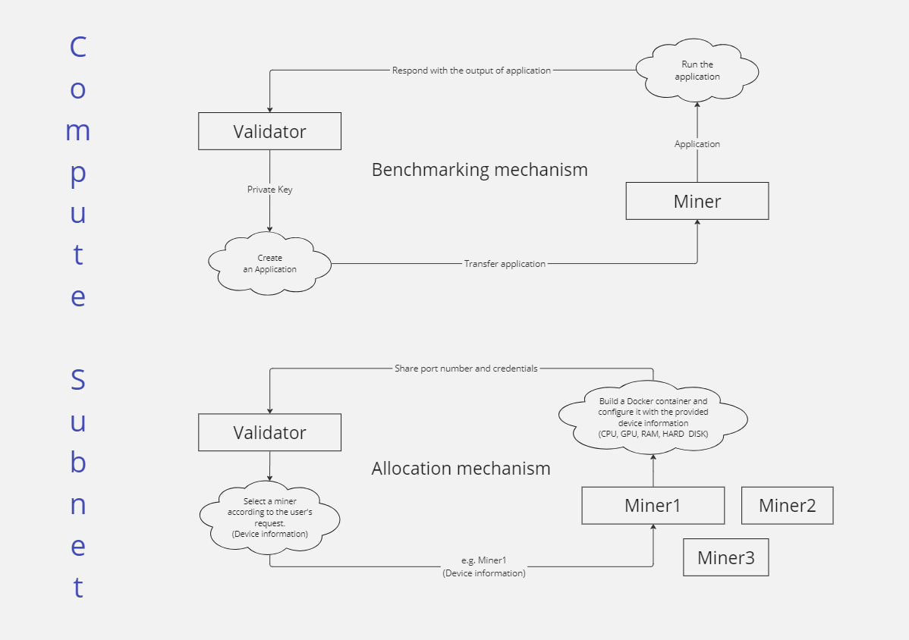

<div align="center">

# **Bittensor Compute Subnet** <!-- omit in toc -->
[](https://discord.gg/bittensor)
[](https://opensource.org/licenses/MIT) 

---

### The Incentivized Internet <!-- omit in toc -->

[Discord](https://discord.gg/bittensor) • [Network](https://taostats.io/) • [Research](https://bittensor.com/whitepaper)

</div>

---

This template contains all the necessary files and functions to define Bittensor's Compute Subnet. You can try running miners on netuid 15 in Bittensor's test network.

# Introduction
The Bittensor blockchain hosts multiple self-contained incentive mechanisms 'subnets'. Subnets are playing fields through which miners (those producing value) and validators (those producing consensus) determine together the proper distribution of TAO for the purpose of incentivizing the creation of value, i.e. generating digital commodities, such as intelligence, or data. Each consists of a wire protocol through which miners and validators interact and their method of interacting with Bittensor's chain consensus engine [Yuma Consensus](https://bittensor.com/documentation/validating/yuma-consensus) which is designed to drive these actors into agreement about who is creating value.



This repository is a compute-composable subnet. This subnet has integrated various cloud platforms (e.g., Runpod, Lambda, AWS) into a cohesive unit, enabling higher-level cloud platforms to offer seamless compute composability across different underlying platforms. With the proliferation of cloud platforms, there's a need for a subnet that can seamlessly integrate these platforms, allowing for efficient resource sharing and allocation. This compute-composable subnet will enable nodes to contribute computational power, with validators ensuring the integrity and efficiency of the shared resources.

- `compute/protocol.py`: The file where the wire-protocol used by miners and validators is defined.
- `neurons/miner.py`: This script which defines the miner's behavior, i.e., how the miner responds to requests from validators.
- `neurons/validator.py`: This script which defines the validator's behavior, i.e., how the validator requests information from miners and determines scores.

---

# Installation
This repository requires python3.8 or higher. To install, simply clone this repository and install the requirements.

## Install Bittensor
```bash
$ /bin/bash -c "$(curl -fsSL https://raw.githubusercontent.com/opentensor/bittensor/master/scripts/install.sh)"
```
## Install Dependencies
```bash
git clone https://github.com/neuralinternet/Compute-Subnet.git
cd Compute-Subnet
python -m pip install -r requirements.txt
python -m pip install -e .
```
## Setup docker for miner
To run a miner, you must [install](https://docs.docker.com/engine/install/ubuntu) and start the docker service by running `sudo systemctl start docker` and `sudo apt install at`.

</div>

---
# Running
Prior to running a miner or validator, you must [create a wallet](https://github.com/opentensor/docs/blob/main/reference/btcli.md) and [register the wallet to a netuid](https://github.com/opentensor/docs/blob/main/subnetworks/registration.md). Once you have done so, you can run the miner and validator with the following commands.

## Running Miner

The miners offer computing services such as GPU and CPU instances, delivering the best user experience in core GPU and CPU computing. Depending on their performance, they can earn greater rewards. The better the device's performance, the higher the reward they receive. Importantly, miners should include GPU instances because a significant amount of computational power is required. GPU miners will receive greater rewards compared to CPU miners.

```bash
# To run the miner
cd neurons
python -m miner.py 
    --netuid <your netuid>  # The subnet id you want to connect to
    --subtensor.network <your chain url>  # blockchain endpoint you want to connect
    --wallet.name <your miner wallet> # name of your wallet
    --wallet.hotkey <your miner hotkey> # hotkey name of your wallet
    --logging.debug # Run in debug mode, alternatively --logging.trace for trace mode
```

## Running Validator

The validators are responsible for evaluating a miner's capabilities. They request miners to send performance information and verify its trustworthiness by presenting hashing problems. They calculate the complexity of these problems based on the miner's performance, measure the response time of the miner, and verify the correctness of the answers. They update the score with this data and determine the miner's weight. Importantly, the score depends on various factors, not only the capacity but also the quality of the device. Validators don't have to include GPU instances since they have minimal traffic and require only a low amount of computational power.

```bash
# To run the validator
cd neurons
python -m validator.py 
    --netuid <your netuid> # The subnet id you want to connect to
    --subtensor.network <your chain url> # blockchain endpoint you want to connect
    --wallet.name <your validator wallet>  # name of your wallet
    --wallet.hotkey <your validator hotkey> # hotkey name of your wallet
    --logging.debug # Run in debug mode, alternatively --logging.trace for trace mode
```

</div>

---

## License
This repository is licensed under the MIT License.
```text
# The MIT License (MIT)
# Copyright © 2023 Neural Internet

# Permission is hereby granted, free of charge, to any person obtaining a copy of this software and associated
# documentation files (the “Software”), to deal in the Software without restriction, including without limitation
# the rights to use, copy, modify, merge, publish, distribute, sublicense, and/or sell copies of the Software,
# and to permit persons to whom the Software is furnished to do so, subject to the following conditions:

# The above copyright notice and this permission notice shall be included in all copies or substantial portions of
# the Software.

# THE SOFTWARE IS PROVIDED “AS IS”, WITHOUT WARRANTY OF ANY KIND, EXPRESS OR IMPLIED, INCLUDING BUT NOT LIMITED TO
# THE WARRANTIES OF MERCHANTABILITY, FITNESS FOR A PARTICULAR PURPOSE AND NONINFRINGEMENT. IN NO EVENT SHALL
# THE AUTHORS OR COPYRIGHT HOLDERS BE LIABLE FOR ANY CLAIM, DAMAGES OR OTHER LIABILITY, WHETHER IN AN ACTION
# OF CONTRACT, TORT OR OTHERWISE, ARISING FROM, OUT OF OR IN CONNECTION WITH THE SOFTWARE OR THE USE OR OTHER
# DEALINGS IN THE SOFTWARE.
```
